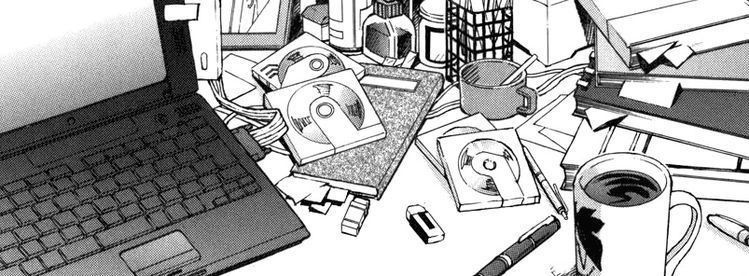

  

 

<table>
  <tr>
    <td valign="middle" width="260">
      
    </td>
    <td valign="middle" style="padding-left:20px">
      <h2>Gafarov Muhammad Ali</h2>
      
Web Developer · Open to work

      

        
      

      
I build clean, fast and user-friendly web applications. Currently looking for full-time or freelance opportunities.

      
      
    </td>
  </tr>
</table>

<table>
<tr>
<td valign="top">

<h2>Tech Stack</h2>

<h4>Languages</h4>

<h4>Frontend</h4>

<h4>Backend</h4>

<h4>Database</h4>

<h4>Tools & DevOps</h4>

 

<h2>Currently Learning</h2>

</td>
<td valign="middle" align="center" width="340">
  
</td>
</tr>
</table>

<h2>Beyond Code</h2>

When I'm not writing code, you'll find me:

- Watching anime — always on the lookout for the next series
- Gaming — from story-driven RPGs to competitive multiplayer
- Streaming — sharing gameplay and vibes live
- Exploring music, design, and whatever catches my attention

> Always online. Always creating.

